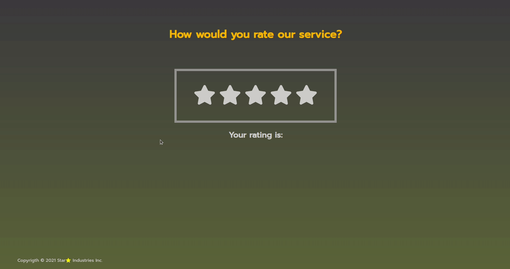

# Create a star rating widget :star::star::star::star::star:

**The rating widget should give the user the option to give a rating from 1 to 5.**

---


As a guidline, how the finished product could be looking, use the picture as a refernce. 

---

## 🏋️‍♀️ Exercise

- Split your app up into components.
- Produce 5 icons.
- To manage your state use the `useState` Hook from React.
- When you hover over the icons, it should give you a preview of how the icons might look.
- The preview should only be temporary, once the user moves the mouse away from the widget, the original state should be rendered.
- The click event should call a handler function, which should change the state - and change the rendered output.

---
## :eye_speech_bubble: Hint

- To display your stars you could use the `<FaStar/>` from React icons. The npm package React icons has already been included in this project. (Have a look in your `package.json` file under dependencies.)

```javascript
//import the icon into your component
import { FaBeer } from 'react-icons/fa';
//use the icon like that in your component
<h3> Lets go for a <FaBeer />? </h3>
```
